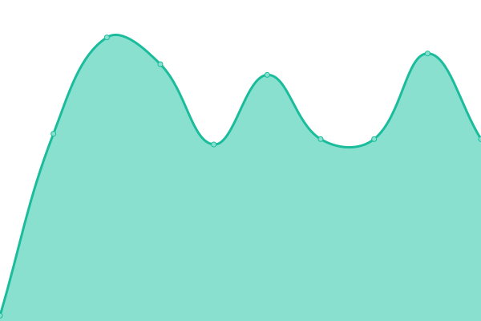
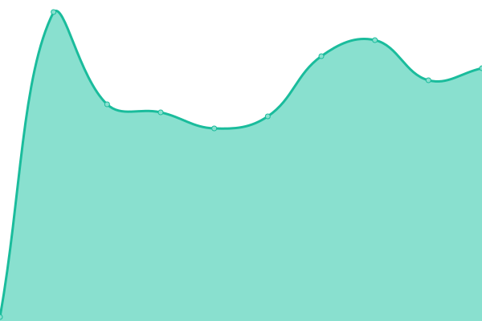

# [📈 Live Status](https://demo.upptime.js.org): <!--live status--> **🟩 All systems operational**

This repository contains the open-source uptime monitor and status page for [Upptime](https://upptime.js.org), powered by [Upptime](https://github.com/upptime/upptime).

With [Upptime](https://upptime.js.org), you can get your own unlimited and free uptime monitor and status page, powered entirely by a GitHub repository. We use [Issues](https://github.com/upptime/upptime/issues) as incident reports, [Actions](https://github.com/Cotterville/upptime/actions) as uptime monitors, and [Pages](https://demo.upptime.js.org) for the status page.

<!--start: status pages-->
<!-- This summary is generated by Upptime (https://github.com/upptime/upptime) -->
<!-- Do not edit this manually, your changes will be overwritten -->
<!-- prettier-ignore -->
| URL | Status | History | Response Time | Uptime |
| --- | ------ | ------- | ------------- | ------ |
|  [DMRTexas.net](https://dmrtexas.net) | 🟩 Up | [dmr-texas-net.yml](https://github.com/Cotterville/upptime/commits/HEAD/history/dmr-texas-net.yml) | 

 858ms
     
 | 

<a href="https://status.dmrtexas.net/history/dmr-texas-net">100.00%</a>
    

|  [CBridge - CBridge 2.0](64.111.99.38) | 🟩 Up | [c-bridge-c-bridge-2-0.yml](https://github.com/Cotterville/upptime/commits/HEAD/history/c-bridge-c-bridge-2-0.yml) | 

 33ms
     
 | 

<a href="https://status.dmrtexas.net/history/c-bridge-c-bridge-2-0">100.00%</a>
    

|  [CBridge - Chicagoland](107.191.49.134) | 🟩 Up | [c-bridge-chicagoland.yml](https://github.com/Cotterville/upptime/commits/HEAD/history/c-bridge-chicagoland.yml) | 

 25ms
     
 | 

<a href="https://status.dmrtexas.net/history/c-bridge-chicagoland">100.00%</a>
    

|  [CBridge - DilloDMR](45.55.152.18) | 🟩 Up | [c-bridge-dillo-dmr.yml](https://github.com/Cotterville/upptime/commits/HEAD/history/c-bridge-dillo-dmr.yml) | 

 30ms
     
 | 

<a href="https://status.dmrtexas.net/history/c-bridge-dillo-dmr">100.00%</a>
    

|  [CBridge - K4USD](160.94.103.68) | 🟩 Up | [c-bridge-k4-usd.yml](https://github.com/Cotterville/upptime/commits/HEAD/history/c-bridge-k4-usd.yml) | 

 31ms
     
 | 

<a href="https://status.dmrtexas.net/history/c-bridge-k4-usd">100.00%</a>
    

|  [CBridge - Lonestar DMR](192.92.239.155) | 🟩 Up | [c-bridge-lonestar-dmr.yml](https://github.com/Cotterville/upptime/commits/HEAD/history/c-bridge-lonestar-dmr.yml) | 

 35ms
     
 | 

<a href="https://status.dmrtexas.net/history/c-bridge-lonestar-dmr">100.00%</a>
    

|  [CBridge - SE Texas](199.66.149.2) | 🟩 Up | [c-bridge-se-texas.yml](https://github.com/Cotterville/upptime/commits/HEAD/history/c-bridge-se-texas.yml) | 

 48ms
     
 | 

<a href="https://status.dmrtexas.net/history/c-bridge-se-texas">99.67%</a>
    

|  [CBridge - TXGulfCoast](66.170.192.14) | 🟩 Up | [c-bridge-tx-gulf-coast.yml](https://github.com/Cotterville/upptime/commits/HEAD/history/c-bridge-tx-gulf-coast.yml) | 

 44ms
     
 | 

<a href="https://status.dmrtexas.net/history/c-bridge-tx-gulf-coast">78.98%</a>
    

|  [CBridge - TxMARC](72.20.134.101) | 🟩 Up | [c-bridge-tx-marc.yml](https://github.com/Cotterville/upptime/commits/HEAD/history/c-bridge-tx-marc.yml) | 

 42ms
     
 | 

<a href="https://status.dmrtexas.net/history/c-bridge-tx-marc">100.00%</a>
    

|  [Brandmeister 3102 (Dallas)](74.91.114.19) | 🟩 Up | [brandmeister-3102-dallas.yml](https://github.com/Cotterville/upptime/commits/HEAD/history/brandmeister-3102-dallas.yml) | 

 71ms
     
 | 

<a href="https://status.dmrtexas.net/history/brandmeister-3102-dallas">100.00%</a>
    

|  [Brandmeister 3103 (San Jose)](74.91.118.251) | 🟩 Up | [brandmeister-3103-san-jose.yml](https://github.com/Cotterville/upptime/commits/HEAD/history/brandmeister-3103-san-jose.yml) | 

 73ms
     
 | 

<a href="https://status.dmrtexas.net/history/brandmeister-3103-san-jose">100.00%</a>
    

|  [Brandmeister 3104 (Chicago)](162.248.88.117) | 🟩 Up | [brandmeister-3104-chicago.yml](https://github.com/Cotterville/upptime/commits/HEAD/history/brandmeister-3104-chicago.yml) | 

 65ms
     
 | 

<a href="https://status.dmrtexas.net/history/brandmeister-3104-chicago">100.00%</a>
    

<!--end: status pages-->

[**Visit our status website →**](https://demo.upptime.js.org)

## 📄 License

- Powered by: [Upptime](https://github.com/upptime/upptime)
- Code: [MIT](./LICENSE) © [Anand Chowdhary](https://anandchowdhary.com), supported by [Pabio](https://pabio.com)
- Data in the `./history` directory: [Open Database License](https://opendatacommons.org/licenses/odbl/1-0/)
